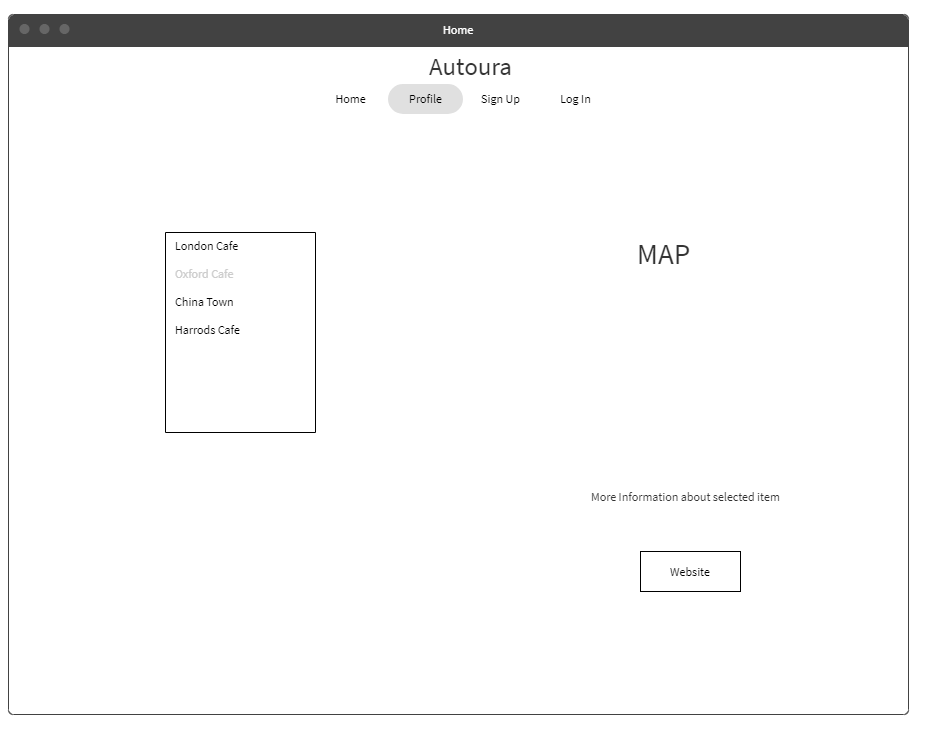
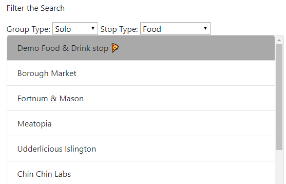
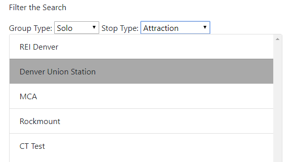

Contents

Firebase Host Link- https://autoura-4c10f.firebaseapp.com/        3

GitHub Host Link - https://github.com/0GOODN34/Autora        3

Background/Research        3

Methods        3

Implementation (Technical)        4

Wireframes        4

Deployment to GitHub Pages/Firebase        5

Real-Time Databases        6

Design patterns        6

Mapping and geolocation        6
        
Progressive web applications        9

Unit testing        9

Evaluation (unit testing)        9

Reflection        10

Bibliography        10

# Firebase Host Link- [https://autoura-4c10f.firebaseapp.com/](https://autoura-4c10f.firebaseapp.com/)

# GitHub Host Link - [https://github.com/0GOODN34/Autora](https://github.com/0GOODN34/Autora)

# Background/Research

Autoura a company that work in the creation of autonomous cars was looking for a web application that would be able to work inside of their cars to be able to provide tourists, sightseers the general public with the ability to be able to search for certain local eateries, points of interest and many other search criteria, when creating this type of system it is best to look into what other organizations have done in the past and then using the research that is found out how it will be implemented into this website.

Vue.js is a framework which is in a similar area to React and Angular but use the best parts of these two frameworks for its own purpose making it a very useful framework also being one of the most demanded frameworks in 2013, Vue uses a system that can make a single page website, this can be done with the help of vue-router which is a system that can be used in the framework do have the ability to be able to have multiple pages in one single application, Vue uses a system called components which allow uses to create props on different pages of the framework but then be able to pass them around as long as the coder calls the prop in with a v-bind function. Overall Vue is like a vast library with multiple different options which can be called upon to perform different tasks in the framework. Vue.js is summed up well by Dmitry when he says, &quot;when it comes to large, powerful systems, the simplicity and friendliness of Vue become game-changers&quot; (Dmitry Reshetchenko, 2019).

When looking for a library that would be able to work as the mapping tool, from previous use in another project using Vue2Leaflet, this mapping JavaScript library was useful before so reusing the same library with Vue.js framework would be helpful. With the extra command that could be used as well, with the icons command being able to be used to display markers on the map showing to location for the users of the sites they wish to see, other commands would be the dialog box being used to make sure the user was selecting the right place they wish to go. One of the main reasons this library was chosen was is simplicity to install into Vue.js and how quickly you are able to display a map on your website. Also hosting a wide range of components that can be used such as the icon, marker and pop-up and more &quot;The components menu offers a detailed view of each component and a playground to test it.&quot; (Vue2Leaflet,2019)

Trip advisor is one of the most used sites online showing users what is around their general area using a postcode and showing them food and attractions and much more, this site uses a similar system to the one that the Autoura website would use but with some differences but using the trip advisor website as a reference to go on as what the website would need to be based around. (TripAdvisor website,2019)

# Methods

After completing the research element moving forward with creating the app using Vue.JS, JavaScript elements, Vue Leaflet and many other libraries that are built into Vue.

Next step would be moving forward into creating different wireframes to see what layout is the best for the website layout this would include looking into having the website be able to move between different mobile platforms and making sure that the website can adapt to changing the size of the screen, this will be done by using size guides which are predefined sizes which can be attached to the webpage so that when the page reduces below a certain size the navigation bar will adapt to the screen the website is opened on.

The tech stack that will be used will be Vue.js, JavaScript, Firebase and GitHub.

When deploying the website using firebase as a hosting platform to be able to create a link which can be accessed by anyone and also hosting the files on GitHub so people can download the files that create the website.

# Implementation (Technical)

## Wireframes

Wireframing is used to give a skeletal layout of the web app in which it shows the structure of the app and shows a little bit about how the user will navigate around the page.

Wireframes for this web app needed to be created to see a layout of how the web app will sit on the screen coming from the point of the user to see what they will be presented with.

A selection of option to eat at in which the place will be displayed on the map section with a list of directions below also having the time open and rating gathered from the API and if the user would like more information by using the button to be redirected to the webpage, Also requesting the users location on opening the app so that they can see what places are around them by doing this the user can filter the list bar to see for place close to the user.

 The wireframe below shows a login screen for the user in which they can only be allowed to do once sign up using the firebase as the back end also once the user has logged in they would not be able to see the login or sign up buttons but be replaced with a log out button. The wireframe also shows the navigation bar running along the top which can be used by users to navigate through the app also has the ability that when the user is logged in, they can view a list of favorite places that they have selected.

 

## Deployment to GitHub Pages/Firebase

Deploying the web application to the firebase to host and be able to let easy of access to the website for users with just sending them a simple link which they can use to access the webpage. Hosting the files on GitHub as well.

Steps in setting up Firebase.

Step 1. Go to firebase website and create project.

Step 2. In terminal:

npm install -g firebase tools.

Firebase login

Firebase init

-picked the project

-picked the hosting option

-Had to choose dist as opposed to public, as vue created a dist folder.

npm run build( to get latest build)

firebase deploy.

## Real-Time Databases

Firebase is the database that we are using as a backend for the web app this will be, this database can give instant responses with people being able to use it for real-time chat blogs, this could work for the web app later on being able to have a live web chat with possible a driver of a taxi or speaking to a café or being able to ask for help through the app with it being linked up to an information center. But using the feedback given on certain places to push to other users, using the webpage to let them know of places other people have been and the review they have left about that place.

## Design patterns

When creating a web application the choice of what the user will use around the web application is very important as some design patterns are used a lot more than others and people understand them very well but some people just cannot get on with them so knowing the audience that will be using the app or having the ability to change the layout if needed by the user is a great way of helping them to interact, navigation is a big part of the web app in which having a menu at the top of the screen keeps to the same form as most of the website that are out there today, the same with this app for the form keeping them as basic as possible was best, using simple search and filter techniques so that users do not get confused when using them as they are supposed to be a helpful tool.

## Mapping and geolocation

The leaflet library is the option that seemed best suited for this web application as being able to only install what is needed and not having to install the full library saves on space and usage, using the many features that it comes with by labelling all of the listed API and having a marker on the map to show them each of them also when clicking on a listed item the map will be changed to show you its current location, the best part of the leaflet library is the geolocation feature which can use the mobile device to get your location and then show you what places are around use. Also being able to change the markers to food icons to help show them up on the map.

Image above shows the coding element for placing the map on the screen. Below is the outcome.

 

Image above shows the code for accessing the results prop that is parsed in from the API search and then gathering their location for each result, below is the outcome.

##

The image above shows the code used to gather the uses location when the page is loaded with this part of the code finding the user on the map and asking the user to allow or block the request which is the image below. 

 
 

The image above shows the code that will control the filter options of the website and will update the results shown in the list. The image on the left is before the filter and the image on the right is after the filter,
                                                            
  

 
## Progressive web applications

This web app does not really show any form of lag or slow as it does not have to load that much but having put in place a loading message for uses just in case the API takes a little while to gather the data that it has gone to collect help just let the user aware that something is happening on the page, giving the web app the ability to be able to just switch from a desktop to a mobile app with ease helps to keep the same form for the user when they have to move from being at home to use the mobile when out at about, also using the same design features that are in most of the modern apps now makes it easier for users to transfer from one app to this one without having to learn a new feature that was not on the previous app they were using. Using technologies such a Vue.js and Firebase which are all trending system in place will keep the website ahead of any changes to come in technology in the future and if so with minimal change needed.

## Unit testing

 

# Evaluation (unit testing)

This testing was perform by working out what selection of tasks needed to be checked in order to make sure the main components of the website are working correctly this testing will be carried out in the early stages so that any changes that need to be made can be carried out while the website is still being worked on, after the website is complete the same test will be carried out to see if the components are all working, if any did have errors or if any new errors come up.

# Reflection

The creation of this web app has been more challenging than would have been able to image as having the ability for adding one line of code to crash the whole app or using an application like cloud 9 which worked well, to begin with, but then transferring from this to a system that is brand new, takes its time and even though mistakes were made along the way with being unable to simple install node.js and then learning more about the framework and database in which when they are applied to work together and contrasted in such a way that they can create an working website that can work without much overheads and also having the ability to be able to have one page that runes several routes thought it is just a surprise, considering that only knowing the simple sections of this web app development area of using only HTML and CSS and now learning different technologies  such as Vue.js, firebase, leaflet and many more. Overall this web app project with its live brief has shown that a business needs asset not just in its own company but can utilize all of the people around it to help improve the business and make it grow, with simply creating a web app that uses an API.

# Bibliography

Reshetchenk, D, 2019 (June 12), _Why use Vue.js for UI web development?_ , viewed 25/06/2019, \&lt;[https://jaxenter.com/vue-js-for-ui-web-development-159281.html](https://jaxenter.com/vue-js-for-ui-web-development-159281.html)\&gt;.

Vue2Leflet, 2019 Components, viewed 25/06/2019 \&lt;[https://korigan.github.io/Vue2Leaflet/#/components/](https://korigan.github.io/Vue2Leaflet/#/components/)\&gt;.

Trip Advisor,2019 viewed 25/06/2019 \&lt;[https://www.tripadvisor.co.uk/](https://www.tripadvisor.co.uk/)\&gt;.
